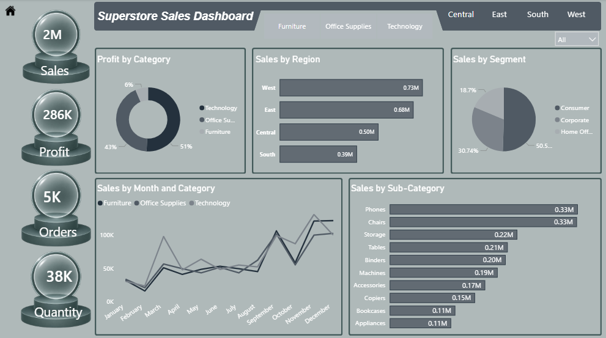

# 📊 Superstore Sales Dashboard

## 🔹 Overview
This dashboard analyzes Superstore sales performance using Power BI.

## 🔹 Key KPIs
- 💰 Sales: 2M
- 📈 Profit: 286K
- 🧾 Orders: 5K
- 📦 Quantity: 38K

## 🔹 Insights
- Technology category generates highest profit (51%)
- West region has highest sales (0.73M)
- Consumer segment contributes ~50% of sales
- Phones & Chairs are top selling sub-categories

## 🔹 Tools Used
- Power BI
- Data Cleaning
- Data Visualization

## 🔹 Dashboard Preview

